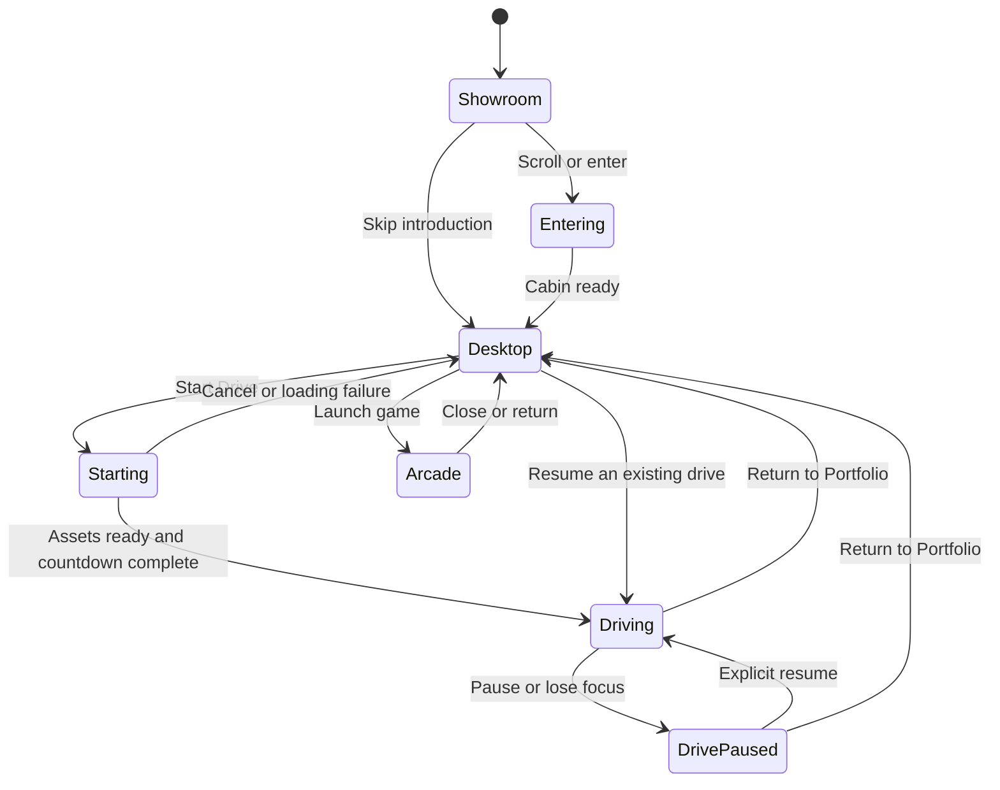

# Rajdeep's Taycan Portfolio

A portfolio inside a Porsche Taycan: scroll into the cabin, explore a Linux-inspired desktop, open real projects, play Doom, or start the car and drive through an endless track.

**Repository:** [r9jdp/folio-2026](https://github.com/r9jdp/folio-2026)

**Status:** Planning and implementation specification. The visual concept has been approved; the application has not been scaffolded. All implementation milestones below are pending. There are no working development commands, production assets or deployed website in this repository yet.

This README is the starting specification for building the experience. Proposed defaults should be validated in the playable prototype before investing heavily in visual polish or replacement assets.

## Contents

- [Product direction](#product-direction)
- [Visitor journey and interaction rules](#visitor-journey-and-interaction-rules)
- [First playable milestone](#first-playable-milestone)
- [Technical architecture](#technical-architecture)
- [Proposed repository structure](#proposed-repository-structure)
- [Assets and car preparation](#assets-and-car-preparation)
- [Linux-inspired desktop](#linux-inspired-desktop)
- [Projects and live applications](#projects-and-live-applications)
- [Driving and endless track](#driving-and-endless-track)
- [Audio](#audio)
- [Doom and arcade](#doom-and-arcade)
- [Loading, performance and accessibility](#loading-performance-and-accessibility)
- [Implementation roadmap](#implementation-roadmap)
- [Verification and definition of done](#verification-and-definition-of-done)
- [Open decisions and references](#open-decisions-and-references)

## Product direction

The main purpose is to communicate Rajdeep Pandey's work as a software developer and product founder. The car creates the first impression; the dashboard presents the portfolio; driving and games give visitors an optional reason to stay.

### Agreed direction

- Porsche Taycan, with a recognisable exterior and a convincing interior.
- A dark studio introduction, followed by a scroll-controlled driver-door opening and cabin entry.
- A large custom dashboard display containing real, interactive web content.
- An original Linux-inspired desktop as the initial interface direction.
- Product icons for Fermeon, TryDonna and ClawIN, alongside conventional portfolio applications.
- **Meetly is optional.** Preserve `https://mymeetly.xyz` if it is included; do not replace its URL or make its availability a prerequisite for launch.
- Optional Start Drive interaction, with electric-car sound and a transition into a continuous driving environment.
- Doom in an optional Arcade application, with its release assets and engine distribution to be selected.
- Immediate access to the portfolio for visitors who skip the 3D introduction.

### Initial design defaults

Use a silver car, charcoal interior surfaces, warm white typography and restrained cyan lighting. Start with a mountain test track at blue hour, with occasional tunnels and checkpoints. These are proposed visual defaults, not requirements to build multiple environments.

The desktop should use familiar windows, icons and controls. A terminal can become a small optional easter egg. Windows XP or macOS-inspired themes can be added later through shared styling; the first implementation should have one coherent theme.

The first release does not need multiplayer, opponent AI, accounts, remote leaderboards, several car models, a complete operating-system emulator or a general-purpose browser. Local distance records and a responsive single-player drive are sufficient.

## Visitor journey and interaction rules

| Stage | Visitor experience | Implementation behaviour |
|---|---|---|
| Arrive | Taycan in a studio, name, role and a short introduction | Render useful HTML immediately; load 3D assets separately; show Skip to Portfolio |
| Enter | Scrolling opens the driver door and moves into the cabin | Use controlled camera progress, collision-aware composition and a reduced-motion alternative |
| Explore | Display wakes into a desktop with a useful portfolio window already open | Mount a real HTML interface; provide product launchers, readable windows and a maximise control |
| Start | Visitor selects Start Drive; the cluster and sound activate | Unlock audio from the click, load the driving package, show progress and remain stationary until ready |
| Transition | Studio lighting sweeps past and the floor becomes a track | Preserve the car and camera; use a covered exit to conceal scenery changes; start a short countdown |
| Drive | Steer, accelerate, brake, pass checkpoints and continue driving | Enable vehicle input, responsive audio, recovery and a persistent Portfolio control |
| Return | Resume the desktop at the project/window previously selected | Pause the vehicle, release driving input and restore desktop state |

### State transitions



Direct portfolio routes must work before the car is available. Skipping entry must also work while car assets are still loading; do not queue a mandatory animation ahead of the requested content.

Only one experience owns keyboard input at a time: desktop, embedded application, driving or arcade. Clear held keys when focus changes. Typing into a website must never move the car. A pointer-lock request, if needed by the game, must follow an explicit action and release cleanly.

The parent page's Return/Close controls remain accessible around external application windows. An Escape shortcut is supplementary: the parent cannot assume it receives key events while focus is inside a cross-origin iframe.

## First playable milestone

The first substantial deliverable is a browser prototype that completes this journey:

**Enter Taycan → use desktop → open Fermeon → return → start car → drive a small circuit → return to the same desktop.**

Acceptance criteria:

- [ ] A prepared Taycan loads with progress and a useful fallback if loading fails.
- [ ] The driver door opens around the correct hinge and the camera enters without clipping.
- [ ] A Linux-inspired desktop is readable and usable inside the display.
- [ ] Fermeon can be launched and its useful visitor flow tested; a local case study and external link always remain available.
- [ ] Start Drive enables sound and hands input to a vehicle controller only when the track is ready.
- [ ] Acceleration, braking, steering, stopping and recovery work on a finite test track.
- [ ] Returning pauses driving and restores desktop state.
- [ ] A visitor can bypass the 3D introduction and read the portfolio directly.
- [ ] Record transfer size, loading behaviour and frame performance on identified reference devices.

The endless environment and complete arcade can follow this milestone. First establish that the content, screen, car and controls work together.

## Technical architecture

| Layer | Proposed technology | Responsibility |
|---|---|---|
| Application and content | Next.js, React, TypeScript | Routes, readable case studies, metadata, desktop and fallback views |
| Rendering | Three.js through React Three Fiber | Car, studio, cabin, lighting, cameras and track |
| Scene helpers | Selected Drei utilities | Model loading, environment helpers and HTML-to-scene alignment where appropriate |
| Animation | One scroll/timeline system, with GSAP as the initial candidate | Door/camera choreography and transition progress |
| Physics | Rapier through React Three Rapier | Collision and contact queries for an arcade vehicle controller |
| Shared state | Small typed store; Zustand is a candidate | Experience mode, selected application, preferences and driving session |
| Desktop layout | React and CSS | Real DOM windows, iframe containers, responsive layout and focus |
| Audio | Web Audio API | Motor layers, ambient effects, UI cues and shared gain controls |
| Asset preparation | Blender and glTF Transform | Geometry cleanup, pivots, materials, optimisation and browser exports |
| Verification | Unit tests for algorithms/state; Playwright for browser flows | Regressions in transitions, controls, embedding and fallbacks |

Select compatible package versions during scaffolding and commit a single package-manager lockfile. Keep browser-only rendering, physics, game and audio code behind client-side boundaries; importing a content route must not initialise them.

Separate frequently updated simulation data from React UI state. Vehicle transforms and frame updates should not trigger a component-tree re-render on every frame. Use a fixed simulation timestep and render interpolation where useful; clamp accumulated time after a suspended tab.

Create an explicit input owner and explicit start/pause/dispose lifecycles for driving and arcade. Scene visibility alone does not stop physics, audio, timers or game loops.

### Proposed routes

| Route | Purpose |
|---|---|
| `/` | Showroom and immersive portfolio entry, with immediately available introduction |
| `/portfolio` | Direct, accessible portfolio view without requiring 3D |
| `/projects/[slug]` | Shareable, readable project case studies |

The same structured content should power direct routes and desktop applications. Preserve useful links and browser navigation; entering a project should not strand a visitor in the 3D view.

## Proposed repository structure

This tree describes the intended application layout. These directories and files do not exist yet.

```text
src/
  app/
    page.tsx
    layout.tsx
    portfolio/page.tsx
    projects/[slug]/page.tsx
  components/
    experience/       # Mode transitions, loading and fallback boundaries
    scene/            # Shared renderer, environments, lighting and cameras
    car/              # Taycan parts, doors, steering, wheels and screen anchor
    desktop/          # Shell, dock, windows, launchers and focus management
    apps/             # About, work, experience, resume, contact and browser views
    driving/          # Vehicle controller, HUD, cameras and controls
    track/            # Road generation, sections, scenery and checkpoints
    arcade/           # Game adapter and lifecycle
    ui/               # Shared accessible controls
  content/
    profile.ts
    projects.ts
    experience.ts
  lib/
    state/            # Typed modes, transitions and preferences
    input/            # Keyboard, pointer and touch ownership
    audio/            # Audio context, mixer and responsive layers
    assets/           # Manifest, loader policy and quality tiers
    track/            # Seeded generation, section constraints and recycling
  styles/
public/
  assets/
    models/           # Prepared runtime assets only
    textures/
    audio/
    icons/
  resume/             # Approved public resume
scripts/
  assets/             # Reproducible preparation, inspection and validation
tests/
  unit/
  e2e/
docs/
  decisions/          # Decisions with consequential tradeoffs
  asset-manifest.json
  performance.md
README.md
```

Keep raw Blender projects, original high-resolution downloads, generated video frames and local render caches outside the normal source checkout. Choose a suitable asset store or Git LFS for large source files when necessary. Runtime asset locations can be moved to object storage/CDN after a deployment target is selected.

During scaffolding, add a `.gitignore` covering dependencies, build caches, local environment files, render output and raw asset directories. Do not commit secrets, downloaded game data or unreviewed third-party binaries as a side effect of importing the prototype.

## Assets and car preparation

### Starting assets

| Asset | Source | Preparation and decision |
|---|---|---|
| Taycan | [Mikhail Hamanovich's model](https://sketchfab.com/3d-models/porshe-taycan-c6004141452e4d3ab048bf0fee52666d) | Existing concept source; embedded metadata identifies CC BY 4.0. Preserve attribution and record modifications |
| Alternative Taycan | [hkv-studios 2020 Taycan](https://www.cgtrader.com/3d-models/car/sport-car/2020-porsche-taycan) | Possible quality upgrade, not purchased or selected; inspect cabin, export suitability and intended web-use terms first |
| Studio lighting | [Poly Haven Studio Small 05](https://polyhaven.com/a/studio_small_05) | Candidate HDRI; use a modest resolution and tune reflections for the car |
| Road material | [ambientCG Asphalt 009](https://ambientcg.com/view?id=Asphalt009) | Candidate PBR surface; verify scale and tiling, then compress web textures |
| Track prototype | [Kenney Racing Kit](https://kenney.nl/assets/racing-kit) | Optional CC0 geometry for early controls/collision testing |
| Landscape and props | [Poly Haven](https://polyhaven.com/) plus custom terrain | Curate a small set, create lower-detail versions and instance repeated scenery |
| Desktop and track system | Original code and design | Build reusable UI and procedural road geometry specifically for this experience |
| Product icons | Approved product logos | Reuse within a consistent icon frame; use clearly labelled text fallbacks if unavailable |

Poly Haven and ambientCG publish their assets under CC0; keep source and licence information for every selected asset even when attribution is optional. The source car, prepared versions, source textures and all game/audio content need individual provenance records.

### Existing concept asset findings

The concept car has approximately **3,007,135 triangles** and a raw geometry buffer of **93,743,444 bytes**. Its doors required custom separation and pivot work for the film. Close-up cabin materials and the screen mount need further refinement.

These findings are from the concept workspace, not assets committed to this repository. Reuse the model inspection, door knowledge, camera composition and visual direction. The film's scripted canvas interface, recorded game sequence and offline rendering must be replaced by event-driven browser interactions.

Do heavy simplification and preparation before shipping an asset. Running a simplifier after downloading the original 94 MB geometry does not solve initial loading cost.

### Blender preparation workflow

1. Import and inspect the source car; establish real-world scale and a consistent forward/up convention.
2. Separate independent moving parts and create a stable naming hierarchy.
3. Set door hinges, wheel centres and steering-wheel pivots; check their motion limits.
4. Repair shading, normals, visible seams and problematic cabin surfaces.
5. Improve materials, the physical screen mount and close-up dashboard presentation.
6. Create lower-detail exterior/cabin variants and simple collision geometry.
7. Bake small surface details into textures where appropriate; retain silhouette quality.
8. Export glTF/GLB while preserving articulated parts and screen anchors.
9. Inspect, deduplicate, simplify and compress with glTF Transform; validate the final export visually and structurally.
10. Record dimensions, triangle count, material count, texture sizes, transfer size and attribution.

Suggested named parts: `body`, `driver_door`, `front_left_wheel`, `front_right_wheel`, `rear_left_wheel`, `rear_right_wheel`, `steering_wheel`, `display_surface`, `display_anchor`, `driver_camera_anchor`, `collision_proxy`.

Blender is a preparation tool; it is not a runtime dependency. Mesh/texture compression reduces transfer size, while geometry simplification, material consolidation and instancing address separate rendering costs. Do not merge moving parts into a static body during optimisation.

Each asset manifest entry should contain an ID, creator, original URL, licence URL, attribution text, acquisition date, source checksum, modifications, runtime files, byte sizes and quality tier. Add a third-party notices document as assets are selected. A repository source-code licence must not be presented as relicensing third-party assets.

## Linux-inspired desktop

### Shell and window behaviour

- Create an original Linux-inspired shell with a top bar, dock, launchers and useful default content.
- Open Work or About initially so visitors can understand the portfolio without discovering every icon.
- Support open, focus, close and maximise/restore; add drag/minimise only if they improve usability.
- Keep windows inside reachable bounds and preserve sensible layouts on resize.
- Implement keyboard access, visible focus, clear labels and sufficiently large touch controls.
- Persist preferences such as mute, quality and optional theme; do not persist embedded application credentials.
- Use a clear title and external-open control for product windows.

### Screen integration

Use a real HTML surface aligned with the 3D dashboard. A cross-origin website cannot simply be drawn into a Three.js canvas texture. Evaluate CSS transforms or Drei Html for alignment, perspective and occlusion.

Keep the screen non-interactive during cabin-entry animation, then settle the camera into a readable composition. Provide a maximise mode with stable typography, scrolling and pointer mapping. On small screens or when 3D is unavailable, render the same applications in a conventional flat layout.

Verify the screen at different viewport sizes, device pixel ratios and browser zoom levels. Account for pointer events, scroll ownership, clipping and stacking relative to the WebGL canvas. Avoid expensive transparency effects if they harm text clarity or performance.

## Projects and live applications

### Application registry

Keep application configuration separate from its presentation. Suggested fields: `id`, `title`, `kind`, `enabled`, `icon`, `caseStudySlug`, `launchUrl`, `embedUrl`, `embedStatus`, `allowedOrigin` and `initialWindowSize`.

| App | Initial scope |
|---|---|
| Fermeon | Primary live-application candidate; persistent cross-tool AI memory product |
| TryDonna | Product case study and external launch; embedded launch after framing policy is resolved |
| ClawIN | Case study and live-application candidate |
| Meetly | Optional, disabled by default; retain `https://mymeetly.xyz` for possible inclusion |
| About | Developer/founder introduction and relevant skills |
| Experience | Résumé-based roles and outcomes |
| Résumé | Readable view and approved PDF download |
| Contact | Approved GitHub, LinkedIn and contact links |
| Arcade | Doom once its engine, content and lifecycle integration are ready |
| Drive | Start or resume the vehicle experience |

Keep project descriptions and résumé facts in structured content. For each project, explain the problem, Rajdeep's contribution, the implementation, the outcome and links to the actual product. Do not invent metrics, employers, responsibilities or testimonials.

### Historical embedding audit

Read-only landing-page checks on **13 September 2026** found the following. Recheck during implementation; these are observations, not permanent guarantees or completed browser tests.

| Project | Observed response | Required follow-up |
|---|---|---|
| Fermeon | `https://www.fermeon.xyz/` returned 200; no X-Frame-Options or CSP header observed | Test a useful embedded visitor flow, including login/redirect behaviour if applicable |
| TryDonna | `https://www.trydonna.net/` returned 200 with `X-Frame-Options: DENY` | Current response blocks embedding; prepare a narrowly scoped embed route or server-policy change |
| ClawIN | `https://www.clawin.xyz/` returned 200; no X-Frame-Options or CSP header observed | Test real interaction, cookies, navigation and login as needed |
| Meetly | `https://mymeetly.xyz` returned 404 | Optional only; keep the agreed URL and use a useful local case study if included |

### Embedding implementation

1. Always provide a local project introduction and an Open in new tab option.
2. Load a live iframe only when its application is opened; avoid booting every external product on desktop startup.
3. For controlled applications, prefer a dedicated demo/embed route with the eventual portfolio origin permitted by CSP `frame-ancestors`; resolve conflicting framing headers on that route.
4. Configure the portfolio's own permitted frame sources. Do not weaken every route of a product to support one portfolio demo.
5. Test authentication, cookie restrictions, redirects, popups and the application's useful task in each target browser. Use guest demos where available.
6. Scope iframe capabilities to what is needed; permit communication only with the expected origins and validate message shapes.
7. Preserve surrounding close/maximise/external-open controls. Do not rely on the parent reading cross-origin DOM content or intercepting its keyboard events.
8. Provide loading progress, cancellation and a visible recovery action. An iframe `load` event is not proof the application is usable; framing failures and cross-origin errors cannot all be detected reliably from the parent.

Changing CORS alone does not resolve iframe framing restrictions. Application-side changes require the relevant repository and chosen portfolio origin; this README does not change any live application configuration.

## Driving and endless track

### Vehicle controller

Build and tune on a small, finite track first. Use an arcade-oriented controller with simple contact/suspension and collision behaviour; select a Rapier controller or custom integration after a focused handling prototype.

- Predictable acceleration, braking, drag, steering and speed limits.
- Stable fixed-step simulation; consistent behaviour across frame rates.
- Wheel rotation, steering-wheel rotation and instrument readings that agree with motion.
- Cockpit camera with restrained acceleration feedback; optional chase camera after cockpit control works.
- Reliable collision response, off-road recovery and respawn at the last valid location.
- A persistent pause/portfolio button and clear control hints.
- Driving input disabled while the desktop, another app or arcade owns focus.

Proposed default controls: W/Up to accelerate, S/Down to brake, A/D or Left/Right to steer, R to recover, and Escape to pause when the driving view owns input. Add explicit touch controls and a visible recovery button; do not make keyboard shortcuts the only route to essential actions.

### Endless road generation

Represent the route as a bounded queue of connected segments, each with entry/exit pose, length, curvature, elevation, road width, mesh references and collision data.

1. Generate a deterministic sequence from a seed.
2. Create sections ahead of the car and recycle distant sections behind it.
3. Constrain joins, slope, curvature and terrain intersections so all generated combinations remain drivable.
4. Reuse mesh/material/prop pools; remove or recycle colliders as well as visible geometry.
5. Place checkpoints and scenery relative to the road centreline, preserving a clear driving corridor.
6. Periodically rebase world coordinates, including physics bodies, track references and camera anchors, to limit precision loss during long drives.
7. Preserve logical distance independently of rebased coordinates.
8. Use tunnels, bends and distant silhouettes to conceal environment changes and draw-distance boundaries.

Begin with one landscape. Add local distance/best-run storage with a versioned format and graceful handling of unavailable browser storage. Future time trials or ghost runs should build on seeded routes; remote score services are not needed initially.

### Studio-to-track transition

Keep the same prepared car and preserve the cabin camera. Load the track before revealing it, change the instrument cluster, blend lighting and cover the scenery transition through a short exit/tunnel. If loading fails or the visitor cancels, return to a usable parked desktop.

Returning to Portfolio pauses the simulation and sound without discarding the visitor's desktop state. An explicit Resume Drive action can restore the session. A future ambient cruise mode must have its own input rules and should not be added implicitly.

## Audio

Use the Taycan's electric character: power-on cue, motor tone linked to throttle/speed, road and wind layers, braking, a door sound and subtle interface feedback. Porsche's Electric Sport Sound is a design reference; an exact factory recording needs a suitable source and licence.

Create one shared audio context and mixer. Resume the context from the Start Drive interaction; smooth volume and pitch changes; crossfade layers; keep output levels controlled. Provide mute and volume controls and remember the visitor's preference.

Pause or suspend sound on backgrounding, lost focus, game/desktop transitions and errors. When returning to the page, require an explicit resume for driving. Avoid duplicate contexts, uncancelled loops or sound continuing after leaving an experience.

Record the source/licence of any downloaded sound. Original synthesized layers can provide the first implementation; recorded effects may replace them after handling and timing are established.

## Doom and arcade

The intended game is Doom. A local WebAssembly experiment in the concept stage demonstrated engine rendering; the website still needs a selected, maintained runtime, release-appropriate game data and full interaction integration.

- Select the engine and game-content distribution explicitly before publishing it.
- Do not assume an open-source engine also grants rights to redistribute every original game asset.
- Consider an appropriate original-game distribution or user-supplied-data route. Freedoom is an alternative with freely distributable content, but it is a different game and must not be silently substituted or labelled as original Doom.
- Load the game package only when launched; isolate game input and audio.
- Handle pointer lock, focus, resize, pause, close and lifecycle cleanup.
- Keep Return to Portfolio available outside the game surface.
- Pause driving while arcade is active; do not run both simulations invisibly.
- Apply the chosen engine's licence obligations and keep attribution with the release.

Keep this distribution decision independent of the car/desktop prototype so it does not block the first playable milestone.

## Loading, performance and accessibility

### Delivery strategy

Render core profile/project HTML first. Load the 3D introduction separately, then request detailed cabin content, the driving package and arcade only when needed. Show genuine progress where measurable and a recoverable loading state otherwise.

Use quality tiers, lower-detail geometry, shared materials, instanced roadside props, limited shadows and adaptive pixel ratio. Avoid continuous rendering when the parked scene is idle. Bound resource pools and dispose of unused GPU/audio resources at defined lifecycle boundaries.

### Initial performance budgets

These are planning targets to validate on named reference hardware, not measured results:

| Area | Initial target |
|---|---|
| Desktop 3D | Approximately 60 fps on an agreed reference desktop |
| Mobile 3D | Approximately 30 fps on an agreed representative supported device |
| Initial 3D transfer | Aim for roughly 8–12 MB or lower; publish measured asset sizes |
| Core portfolio | Readable before 3D, game or driving downloads complete |
| Endless driving | Stable object/collider counts and bounded memory during a sustained session |
| Idle desktop | Avoid unnecessary physics, game, audio and render loops |

Select reference browsers/devices and record the network profile before treating these targets as acceptance gates. Document measurements and quality tradeoffs in `docs/performance.md` when it is created.

### Accessible and resilient paths

- Direct routes and Skip to Portfolio provide useful content without mandatory 3D navigation.
- Honour reduced motion with a direct or brief cabin transition and restrained camera effects.
- Provide visible focus, labelled controls, readable contrast and keyboard navigation.
- Use a full-width desktop/app view on small screens; enable driving controls only where usable.
- Offer a useful fallback when WebGL is unavailable, a model fails or a product site is down.
- Keep browser scrolling and application scrolling predictable; release scroll capture after entry.
- Test zoom, orientation changes, iframe focus and touch interactions.
- Do not autoplay vehicle sound before a visitor starts the experience.

## Implementation roadmap

### Phase 0 — Establish the project

- [ ] Scaffold Next.js/React/TypeScript and select compatible dependency versions.
- [ ] Choose one package manager and commit its lockfile.
- [ ] Add ignore rules, formatting, linting and type checking.
- [ ] Define shared content, application registry, mode transitions and input ownership.
- [ ] Add useful direct portfolio routes and loading/error boundaries.
- [ ] Create an asset manifest and decide where raw versus runtime assets belong.
- [ ] Replace this README's planning-only status with accurate setup instructions once scripts exist.

**Exit:** A runnable application shell with meaningful HTML content and documented real commands.

### Phase 1 — Car and screen proof

- [ ] Import the concept asset into the preparation workflow.
- [ ] Correct moving-part hierarchy, door pivots and camera anchors.
- [ ] Produce and inspect a lighter runtime export.
- [ ] Implement showroom, door opening and cabin entry.
- [ ] Mount a readable, clickable HTML display and a basic Linux-inspired shell.
- [ ] Test Fermeon as the first live application candidate, with case-study/external-link fallback.
- [ ] Measure loading size and rendering performance.

**Exit:** Enter the car and use one real project through the dashboard.

### Phase 2 — Portfolio desktop

- [ ] Implement launchers, window focus, close and maximise/restore.
- [ ] Populate About, Work, Experience, Résumé and Contact from approved content.
- [ ] Add Fermeon, TryDonna and ClawIN entries and local case studies.
- [ ] Keep Meetly disabled/optional with its preserved URL.
- [ ] Connect desktop applications to shareable content routes.
- [ ] Implement responsive screen layouts and accessible navigation.

**Exit:** A useful portfolio regardless of external application availability.

### Phase 3 — Small driving prototype

- [ ] Implement Start Drive, loading/cancel, sound unlock and countdown.
- [ ] Build a finite test track and vehicle collision/controller prototype.
- [ ] Tune steering, acceleration, braking, camera and recovery.
- [ ] Connect wheel/steering visuals, cluster and initial sound layers.
- [ ] Add pause, focus-loss behaviour and Return/Resume controls.
- [ ] Preserve desktop state across driving transitions.

**Exit:** Complete the first playable journey from portfolio entry through driving and back.

### Phase 4 — Endless environment

- [ ] Build seeded segment generation and constrained seamless joins.
- [ ] Add pooled/recycled meshes, scenery and colliders.
- [ ] Implement world rebasing, logical distance and checkpoint recovery.
- [ ] Add one coherent landscape and the studio-to-track transition.
- [ ] Tune responsive motor, road/wind and braking sound.
- [ ] Add local run statistics and optional chase camera.
- [ ] Profile a sustained drive and correct growth, popping and road discontinuities.

**Exit:** Continuous driving with stable resource use and reliable return to the desktop.

### Phase 5 — Complete applications and arcade

- [ ] Recheck the documented project URLs and framing responses.
- [ ] Prepare scoped TryDonna embedding changes when its repository and portfolio origin are available.
- [ ] Test useful application flows and preserve external-open controls.
- [ ] Decide on Doom runtime and release content; document their licences.
- [ ] Implement game input, sound, pause and cleanup.
- [ ] Confirm no input or simulation leaks between app, arcade and driving modes.

**Exit:** Every enabled launcher has a useful, reliable outcome.

### Phase 6 — Finish and release preparation

- [ ] Refine car/cabin appearance, display integration, lighting and transitions.
- [ ] Validate desktop and mobile layouts, reduced motion and WebGL fallback.
- [ ] Run the browser, state/input, loading and performance checks below.
- [ ] Complete asset notices, metadata and approved public résumé/contact information.
- [ ] Select deployment hosting and production origin; configure asset caching and frame policy accordingly.
- [ ] Document build/deployment commands after they exist and prepare a reviewable release.

**Exit:** A tested, deployable portfolio with documented constraints and no undocumented asset dependencies.

## Verification and definition of done

Use tests for the behaviour that can fail meaningfully. Visual inspection and device profiling remain necessary for the car, screen and motion; a unit test alone cannot establish their quality.

| Area | Required evidence |
|---|---|
| Core content | Direct project/portfolio routes work before 3D loads and without visiting the showroom |
| Entry | Door hinge and camera path are visually correct; skip and reduced-motion paths work |
| Screen | Text stays legible, pointer mapping is correct and no window becomes unreachable on resize |
| External apps | Test real visitor tasks; framing errors, unavailable sites and login limitations have useful recovery |
| State/input | Typing never steers; focus loss clears controls; return/resume preserves intended state |
| Vehicle | Fixed-step behaviour, collisions, braking, recovery and both supported input methods work |
| Track | Seed reproducibility, compatible joins, valid collider recycling and rebasing preserve distance/progress |
| Long drive | Run for at least 15 minutes on reference hardware; record object counts and memory trend after warm-up |
| Audio | Explicit start, mute persistence, pause/resume and background suspension work without duplicate loops |
| Arcade | Launch, focus, input, resize, return and resource cleanup work; release assets have documented provenance |
| Accessibility | Keyboard/touch operation, visible focus, readable contrast, zoom and reduced motion are checked |
| Resilience | Slow network, asset failures, repeated mode changes, background tabs and WebGL failure remain recoverable |
| Browser support | Check current Chrome, Firefox and Safari where available, plus representative Android/iOS devices; state any untested gaps |

Add unit coverage for transition rules, input-owner arbitration and deterministic track/rebasing algorithms. Add browser coverage for the main entry → app → drive → return journey and direct/fallback content routes. Run build, lint and type checks once the scaffold provides them. Avoid tests that merely repeat static content or implementation details.

For each milestone, update its checkboxes only after the exit criteria have been demonstrated. Record consequential design changes and performance measurements so later work can continue without guessing what was established.

## Open decisions and references

### Decisions to resolve during implementation

- Whether the prepared concept car is strong enough for final cabin close-ups, or a replacement/artist pass is justified.
- Exact screen dimensions and mounting, based on readable live applications rather than the film's composition alone.
- Final Linux-inspired visual treatment; alternate OS themes remain later options.
- Arcade vehicle-controller tuning and the appropriate physics integration.
- Production hosting, domain and any controlled application embed routes.
- Original Doom runtime/content distribution and mobile game support.
- Reference devices and performance budgets after measurement.
- Whether to enable Meetly; its existing URL remains unchanged unless explicitly revised.

### References

- [React Three Fiber](https://r3f.docs.pmnd.rs/) and [performance guidance](https://r3f.docs.pmnd.rs/advanced/scaling-performance)
- [React Three Rapier](https://pmndrs.github.io/react-three-rapier/)
- [glTF Transform CLI and optimisation tools](https://gltf-transform.dev/cli)
- [MDN: X-Frame-Options](https://developer.mozilla.org/en-US/docs/Web/HTTP/Reference/Headers/X-Frame-Options)
- [MDN: CSP frame-ancestors](https://developer.mozilla.org/en-US/docs/Web/HTTP/Reference/Headers/Content-Security-Policy/frame-ancestors)
- [MDN: browser audio/autoplay behaviour](https://developer.mozilla.org/en-US/docs/Web/Media/Guides/Autoplay)
- [Porsche: Taycan Electric Sport Sound](https://newsroom.porsche.com/en_US/products/taycan/sound-18556.html)
- [Poly Haven asset licence](https://polyhaven.com/license) and [ambientCG licence](https://docs.ambientcg.com/license/)
- [Concept-stage Doom WebAssembly port](https://github.com/diekmann/wasm-fizzbuzz/tree/51a7030bea563d96027301a36619c17347b9270d/doom)
- [Freedoom and its distinction from original Doom](https://freedoom.github.io/about.html)

Research observations above are dated 13 September 2026. Verify live application behaviour, package compatibility and selected asset terms at implementation time.
