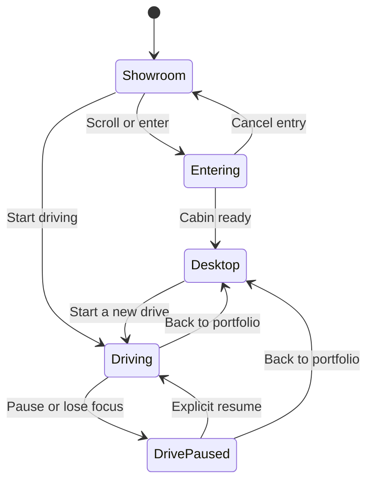

# Rajdeep's Taycan Portfolio

A portfolio inside a Porsche Taycan: scroll into the cabin, explore the dashboard, or start driving on an endless coastal highway. Doom remains a planned extension.

**Repository:** [r9jdp/folio-2026](https://github.com/r9jdp/folio-2026)

**Status:** The application includes the prepared Taycan showroom, reversible scroll-controlled door/camera entry, dashboard portfolio apps, a focused screen camera, an optional reading view, and direct portfolio/project pages. Start driving now opens a playable endless coastal road with keyboard/touch controls, chase and hood cameras, optional synthesized sound, pause/resume and return to the portfolio. Vehicle handling and scenery are an arcade prototype; wheel articulation, richer driving physics, live iframe integration, Doom and deployment remain pending.

This README combines the current implementation with the longer specification. Checked tasks describe implemented scope; remaining visual, browser and performance acceptance work is called out separately.

## Run locally

Use Node.js 22.18+ and npm. No API keys are needed for the portfolio or driving game.

```sh
npm ci
npm run dev
```

Open http://127.0.0.1:3000. `npm run check` runs linting, TypeScript and the state/simulation tests. `npm run build` creates a production build, and `npm start` serves it. `npm run format` and `npm run format:check` manage formatting. See [development handoff](docs/development.md) for dependency constraints and architecture.

The approved video reference is [in this repository](docs/reference/taycan-concept.mp4). Asset preparation and current limits are described in [assets.md](docs/assets.md); source attribution is in [THIRD_PARTY_NOTICES.md](THIRD_PARTY_NOTICES.md).

Entry follows wheel or touch progress in either direction. A keyboard-accessible position slider and Continue button provide alternatives; Enter the Taycan plays the route automatically. Reduced motion skips the camera movement. The central display is a real DOM surface projected into the dashboard. Work, About, Experience, Contact and project summaries open inside it, moving the camera closer; the reading view is an explicit choice for longer content. Cockpit view restores the wide camera while keeping the selected app. Viewports at or below 760px use the reading layout directly. Cabin geometry and materials remain prototype quality. Live product links work; iframe integration and Doom are still pending.

Start driving is available from the showroom, dashboard home, cockpit controls and reading view. W/Up accelerates; S/Down or Space brakes; A/D or Left/Right steers. C switches chase/hood camera, M toggles sound, and Escape/P pauses or resumes. Touch controls provide steering and pedals. Cruise keeps accelerating while you steer; braking or pausing cancels it. Back to portfolio preserves the selected app; starting again begins a new drive.

## Contents

- [Product direction](#product-direction)
- [Visitor journey and interaction rules](#visitor-journey-and-interaction-rules)
- [First playable milestone](#first-playable-milestone)
- [Technical architecture](#technical-architecture)
- [Current repository structure](#current-repository-structure)
- [Assets and car preparation](#assets-and-car-preparation)
- [Dashboard applications](#dashboard-applications)
- [Projects and live applications](#projects-and-live-applications)
- [Driving and endless track](#driving-and-endless-track)
- [Audio](#audio)
- [Doom and arcade](#doom-and-arcade)
- [Loading, performance and accessibility](#loading-performance-and-accessibility)
- [Implementation roadmap](#implementation-roadmap)
- [Verification and definition of done](#verification-and-definition-of-done)
- [Open decisions and references](#open-decisions-and-references)

## Product direction

The main purpose is to communicate Rajdeep Pandey's work as a software developer and product founder. The car creates the first impression; the dashboard presents the portfolio; driving and games give visitors an optional reason to stay.

### Agreed direction

- Porsche Taycan, with a recognisable exterior and a convincing interior.
- A dark studio introduction, followed by a scroll-controlled driver-door opening and cabin entry.
- A physically integrated central dashboard display containing real, interactive web content.
- An original Porsche-inspired infotainment interface, with in-screen navigation and optional reading view.
- Product icons for Fermeon, TryDonna and ClawIN, alongside conventional portfolio applications.
- **Meetly is optional.** Preserve `https://mymeetly.xyz` if it is included; do not replace its URL or make its availability a prerequisite for launch.
- Optional Start driving interaction, with synthesized electric-car sound and a continuous coastal driving environment.
- Doom in an optional Arcade application, with its release assets and engine distribution to be selected.
- Immediate access to the portfolio for visitors who skip the 3D introduction.

### Initial design defaults

The current scene pairs a silver car and charcoal interior with a warm coastal road, mountain slopes, ocean, guardrails and roadside trees. The drive has no finish line, opponents or objectives. Tunnels, alternate weather and checkpoints are optional future additions, not required for free driving.

Use a single automotive interface: dark glass surfaces, a vertical shortcut rail, clear application titles and restrained red selection accents. Keep short content in the physical screen and longer case studies in the optional reading view.

The first release does not need multiplayer, opponent AI, accounts, remote leaderboards, several car models, a complete operating-system emulator or a general-purpose browser. Local distance records and a responsive single-player drive are sufficient.

## Visitor journey and interaction rules

| Stage | Visitor experience | Implementation behaviour |
|---|---|---|
| Arrive | Taycan in a studio, name, role and introduction | Render useful HTML immediately; offer the standard portfolio and Start driving |
| Enter | Scrolling opens the driver door and moves into the cabin | Reversible camera progress, automatic/keyboard alternatives and reduced-motion entry |
| Explore | Portfolio apps open inside the display | Focus the screen, offer a reading view, preserve the selected app |
| Start | Select Start driving from the showroom or portfolio | Unlock optional audio from the click; show a loading state; block movement until the scene is ready |
| Drive | Accelerate, steer, brake and keep following the road | Fixed-step arcade controller, endlessly recycled scenery, speed/distance HUD, chase or hood camera |
| Pause | Pause manually or leave the window/tab | Clear held controls, suspend audio, stop simulation; require explicit resume |
| Return | Back to portfolio restores the selected app | Dispose driving/audio resources; return to the parked cockpit; the next Start creates a fresh run |

### State transitions



`DrivePaused` is a guarded flag within driving mode. The loading/error interface also prevents movement; a failed driving scene provides a route back to the portfolio. The current scene switches from studio to road after loading. A continuous studio-exit animation and countdown are future polish. Arcade states will be introduced with the actual game runtime.

Direct portfolio routes must work before the car is available. Skipping entry must also work while car assets are still loading; do not queue a mandatory animation ahead of the requested content.

Only one experience owns keyboard input at a time: desktop, embedded application, driving or arcade. Clear held keys when focus changes. Typing into a website must never move the car. A pointer-lock request, if needed by the game, must follow an explicit action and release cleanly.

The parent page's Return/Close controls remain accessible around external application windows. An Escape shortcut is supplementary: the parent cannot assume it receives key events while focus is inside a cross-origin iframe.

## First playable milestone

The implemented local journey is:

**Enter Taycan → open a portfolio project → start driving → follow the endless road → return to the selected portfolio app.**

Implemented scope:

- [x] Prepared Taycan, entry controls, dashboard apps and explicit reading view.
- [x] Start driving from the showroom, dashboard and reading view.
- [x] Acceleration, braking, steering and forgiving guardrail response on the endless road.
- [x] Chase/hood cameras, keyboard/touch controls and a speed/distance HUD.
- [x] Optional procedural audio, mute, pause on focus loss and explicit resume.
- [x] Return to the portfolio with the selected application preserved.
- [x] Direct portfolio routes that bypass the 3D experience.

Remaining release evidence and refinements:

- [ ] Refine door/cabin geometry and wheel/steering articulation; visually validate all camera paths.
- [ ] Verify useful live embedded project flows; local case studies and external links remain available now.
- [ ] Complete target-browser, touch-device and repeated lifecycle checks for driving.
- [ ] Record loading behaviour and a sustained drive on identified reference hardware.

The driving loop is implemented without waiting for a separate finite-track prototype. The complete arcade, embedded applications and performance acceptance work remain outside this delivered scope.

## Technical architecture

| Layer | Current technology | Responsibility |
|---|---|---|
| Application and content | Next.js, React, TypeScript | Routes, readable case studies, metadata, desktop and fallback views |
| Rendering | Three.js through React Three Fiber | Car, studio, cabin, lighting, cameras and track |
| Scene helpers | Selected Drei utilities | Model loading, environment helpers and HTML-to-scene alignment where appropriate |
| Animation | React Three Fiber with one scroll target and camera timeline | Reversible door/camera choreography; timed automatic entry and screen focus |
| Driving simulation | Custom TypeScript arcade controller | Fixed 120 Hz steps, speed-sensitive steering, braking, road-relative motion and simple guardrail contact; no physics engine |
| Shared state | Zustand plus mutable simulation refs | Guarded experience/input modes, selected application and pause state; refs hold vehicle motion |
| Desktop layout | React and CSS | Real DOM dashboard/reading views, responsive layout and focus; iframe integration is pending |
| Audio | Web Audio API | Procedural motor/wind, startup tone, mute and explicit context lifetime |
| Asset preparation | Blender and glTF Transform | Geometry cleanup, pivots, materials, optimisation and browser exports |
| Verification | TypeScript, ESLint and Node tests; browser inspection | State transitions, controller and terrain algorithms; visual and interaction checks remain separate |

The selected compatible package versions are committed in one npm lockfile. Keep browser-only rendering, physics, game and audio code behind client-side boundaries; importing a content route must not initialise them.

Separate frequently updated simulation data from React UI state. Vehicle transforms and frame updates should not trigger a component-tree re-render on every frame. Use a fixed simulation timestep and render interpolation where useful; clamp accumulated time after a suspended tab.

Create an explicit input owner and explicit start/pause/dispose lifecycles for driving and arcade. Scene visibility alone does not stop physics, audio, timers or game loops.

### Current routes

| Route | Purpose |
|---|---|
| `/` | Showroom and immersive portfolio entry, with immediately available introduction |
| `/portfolio` | Direct, accessible portfolio view without requiring 3D |
| `/projects/[slug]` | Shareable, readable project case studies |

The same structured content should power direct routes and desktop applications. Preserve useful links and browser navigation; entering a project should not strand a visitor in the 3D view.

## Current repository structure

```text
src/
  app/                         # Showroom, direct portfolio/project routes, credits
  components/
    experience/
      showroom.tsx             # Entry, mode handoff and driving audio lifetime
      taycan-scene.tsx          # Parked car, studio, entry and focused camera
      dashboard*.tsx           # Physical display and portfolio applications
      driving-game.tsx         # Controls, pause dialog, HUD and local best distance
      drive-scene.tsx           # Driving canvas, road, terrain, scenery and cameras
    desktop/                   # Expanded reading view
  content/                     # Shared approved content and application registry
  lib/
    driving.ts                 # Arcade controller and analytic road curve
    drive-terrain.ts            # Terrain heights and rendered-triangle sampling
    drive-audio.ts              # Procedural Web Audio motor/wind lifecycle
    taycan-model.ts             # Shared model cloning/material preparation
  state/experience.ts          # Mode guards and input ownership
public/
  models/taycan-preview.glb     # Prepared runtime car
  textures/                    # Original parked display graphics
  resume.pdf
assets/manifest.json           # Model provenance and measurements
scripts/prepare-taycan.mjs     # Reproducible offline asset preparation
tests/                         # State, display, controller and terrain checks
docs/                          # Handoff, asset notes and approved reference film
```

Keep raw Blender projects, high-resolution source downloads, generated video frames and render caches outside the source checkout. The driving landscape, road texture and sound are generated by original code; this milestone adds no downloaded scenery or audio assets. Future arcade/embedding code should be introduced when those runtimes are selected.

## Assets and car preparation

### Starting assets

| Asset | Source | Preparation and decision |
|---|---|---|
| Taycan | [Mikhail Hamanovich's model](https://sketchfab.com/3d-models/porshe-taycan-c6004141452e4d3ab048bf0fee52666d) | Existing concept source; embedded metadata identifies CC BY 4.0. Preserve attribution and record modifications |
| Alternative Taycan | [hkv-studios 2020 Taycan](https://www.cgtrader.com/3d-models/car/sport-car/2020-porsche-taycan) | Possible quality upgrade, not purchased or selected; inspect cabin, export suitability and intended web-use terms first |
| Studio lighting | [Poly Haven Studio Small 05](https://polyhaven.com/a/studio_small_05) | Candidate HDRI; use a modest resolution and tune reflections for the car |
| Road material | Original procedural asphalt texture | Current runtime; [ambientCG Asphalt 009](https://ambientcg.com/view?id=Asphalt009) remains a possible future PBR upgrade |
| Track prototype | [Kenney Racing Kit](https://kenney.nl/assets/racing-kit) | Optional CC0 geometry for early controls/collision testing |
| Landscape and props | Original procedural terrain, ocean, rocks and trees | Current runtime; [Poly Haven](https://polyhaven.com/) remains a candidate for later asset refinement |
| Desktop and track system | Original code and design | Build reusable UI and procedural road geometry specifically for this experience |
| Product icons | Approved product logos | Reuse within a consistent icon frame; use clearly labelled text fallbacks if unavailable |

Poly Haven and ambientCG publish their assets under CC0; keep source and licence information for every selected asset even when attribution is optional. The source car, prepared versions, source textures and all game/audio content need individual provenance records.

### Existing concept asset findings

The concept car has approximately **3,007,135 triangles** and a raw geometry buffer of **93,743,444 bytes**. Its doors required custom separation and pivot work for the film. Close-up cabin materials and the screen mount need further refinement.

These findings are from the concept workspace, not assets committed to this repository. Reuse the model inspection, door knowledge, camera composition and visual direction. The film's scripted canvas interface, recorded game sequence and offline rendering must be replaced by event-driven browser interactions.

Do heavy simplification and preparation before shipping an asset. Running a simplifier after downloading the original 94 MB geometry does not solve initial loading cost.

### Blender preparation workflow

1. Import and inspect the source car; establish real-world scale and a consistent forward/up convention.
2. Separate independent moving parts and create a stable naming hierarchy.
3. Set door hinges, wheel centres and steering-wheel pivots; check their motion limits.
4. Repair shading, normals, visible seams and problematic cabin surfaces.
5. Improve materials, the physical screen mount and close-up dashboard presentation.
6. Create lower-detail exterior/cabin variants and simple collision geometry.
7. Bake small surface details into textures where appropriate; retain silhouette quality.
8. Export glTF/GLB while preserving articulated parts and screen anchors.
9. Inspect, deduplicate, simplify and compress with glTF Transform; validate the final export visually and structurally.
10. Record dimensions, triangle count, material count, texture sizes, transfer size and attribution.

Suggested named parts: `body`, `driver_door`, `front_left_wheel`, `front_right_wheel`, `rear_left_wheel`, `rear_right_wheel`, `steering_wheel`, `display_surface`, `display_anchor`, `driver_camera_anchor`, `collision_proxy`.

Blender is a preparation tool; it is not a runtime dependency. Mesh/texture compression reduces transfer size, while geometry simplification, material consolidation and instancing address separate rendering costs. Do not merge moving parts into a static body during optimisation.

Each asset manifest entry should contain an ID, creator, original URL, licence URL, attribution text, acquisition date, source checksum, modifications, runtime files, byte sizes and quality tier. Add a third-party notices document as assets are selected. A repository source-code licence must not be presented as relicensing third-party assets.

## Dashboard applications

### Shell and window behaviour

- Use the original automotive home screen, shortcut rail, project launchers and in-screen summaries.
- Open the clearly labelled home screen; preserve the selected application when returning from reading view or the showroom.
- Support open, focus, close and maximise/restore; add drag/minimise only if they improve usability.
- Keep windows inside reachable bounds and preserve sensible layouts on resize.
- Implement keyboard access, visible focus, clear labels and sufficiently large touch controls.
- Persist preferences such as mute, quality and optional theme; do not persist embedded application credentials.
- Use a clear title and external-open control for product windows.

### Screen integration

Use a real HTML surface aligned with the 3D dashboard. A cross-origin website cannot simply be drawn into a Three.js canvas texture. Evaluate CSS transforms or Drei Html for alignment, perspective and occlusion.

Keep the screen non-interactive during cabin-entry animation, then settle the camera into a readable composition. Provide a maximise mode with stable typography, scrolling and pointer mapping. On small screens or when 3D is unavailable, render the same applications in a conventional flat layout.

Verify the screen at different viewport sizes, device pixel ratios and browser zoom levels. Account for pointer events, scroll ownership, clipping and stacking relative to the WebGL canvas. Avoid expensive transparency effects if they harm text clarity or performance.

## Projects and live applications

### Application registry

Keep application configuration separate from its presentation. Suggested fields: `id`, `title`, `kind`, `enabled`, `icon`, `caseStudySlug`, `launchUrl`, `embedUrl`, `embedStatus`, `allowedOrigin` and `initialWindowSize`.

| App | Initial scope |
|---|---|
| Fermeon | Primary live-application candidate; persistent cross-tool AI memory product |
| TryDonna | Product case study and external launch; embedded launch after framing policy is resolved |
| ClawIN | Case study and live-application candidate |
| Meetly | Optional, disabled by default; retain `https://mymeetly.xyz` for possible inclusion |
| About | Developer/founder introduction and relevant skills |
| Experience | Résumé-based roles and outcomes |
| Résumé | Readable view and approved PDF download |
| Contact | Approved GitHub, LinkedIn and contact links |
| Arcade | Doom once its engine, content and lifecycle integration are ready |
| Drive | Start a new free drive; resume an existing run from its pause dialog |

Keep project descriptions and résumé facts in structured content. For each project, explain the problem, Rajdeep's contribution, the implementation, the outcome and links to the actual product. Do not invent metrics, employers, responsibilities or testimonials.

### Historical embedding audit

Read-only landing-page checks on **13 September 2026** found the following. Recheck during implementation; these are observations, not permanent guarantees or completed browser tests.

| Project | Observed response | Required follow-up |
|---|---|---|
| Fermeon | `https://www.fermeon.xyz/` returned 200; no X-Frame-Options or CSP header observed | Test a useful embedded visitor flow, including login/redirect behaviour if applicable |
| TryDonna | `https://www.trydonna.net/` returned 200 with `X-Frame-Options: DENY` | Current response blocks embedding; prepare a narrowly scoped embed route or server-policy change |
| ClawIN | `https://www.clawin.xyz/` returned 200; no X-Frame-Options or CSP header observed | Test real interaction, cookies, navigation and login as needed |
| Meetly | `https://mymeetly.xyz` returned 404 | Optional only; keep the agreed URL and use a useful local case study if included |

### Embedding implementation

1. Always provide a local project introduction and an Open in new tab option.
2. Load a live iframe only when its application is opened; avoid booting every external product on desktop startup.
3. For controlled applications, prefer a dedicated demo/embed route with the eventual portfolio origin permitted by CSP `frame-ancestors`; resolve conflicting framing headers on that route.
4. Configure the portfolio's own permitted frame sources. Do not weaken every route of a product to support one portfolio demo.
5. Test authentication, cookie restrictions, redirects, popups and the application's useful task in each target browser. Use guest demos where available.
6. Scope iframe capabilities to what is needed; permit communication only with the expected origins and validate message shapes.
7. Preserve surrounding close/maximise/external-open controls. Do not rely on the parent reading cross-origin DOM content or intercepting its keyboard events.
8. Provide loading progress, cancellation and a visible recovery action. An iframe `load` event is not proof the application is usable; framing failures and cross-origin errors cannot all be detected reliably from the parent.

Changing CORS alone does not resolve iframe framing restrictions. Application-side changes require the relevant repository and chosen portfolio origin; this README does not change any live application configuration.

## Driving and endless track

### Vehicle controller

`src/lib/driving.ts` implements a lightweight arcade controller. The scene advances it at a fixed 120 Hz, caps accumulated frame time at 100 ms and discards paused time. It models forward acceleration, braking, drag, speed-sensitive steering and a forgiving guardrail response. It is not a rigid-body, tyre or suspension simulation; Rapier is not a dependency.

The car is positioned relative to the road centre. Curves require steering; touching a guardrail slows the car and nudges its heading inward. The current car cannot leave the road, so there is no reset/respawn control. Reverse, traffic, opponents, damage, checkpoints and time trials are not implemented.

| Action | Keyboard | On-screen control |
|---|---|---|
| Accelerate | W or Up | Hold DRIVE pedal on touch layouts |
| Brake | S, Down or Space | Hold BRAKE pedal on touch layouts |
| Steer | A/D or Left/Right | Hold left/right arrows on touch layouts |
| Cruise | — | Cruise toggle beside the speed display holds acceleration; steering remains manual |
| Camera | C | Camera button switches chase and hood/bonnet views |
| Sound | M | Sound button |
| Pause/resume | Escape or P | Pause button and explicit Resume driving action |
| Return | — | Back to portfolio |

Cruise holds the accelerator rather than a chosen speed; it does not steer. Braking, pausing, leaving the window/tab or ending the drive cancels it. Resuming or starting a new drive leaves Cruise off until it is explicitly enabled again.

There is no cockpit driving camera yet. The hood view and chase view use the same prepared Taycan, restrained camera smoothing and an optional speed-dependent field of view. Reduced motion removes body roll, camera easing and speed-based field-of-view changes. The HUD reads actual controller speed and logical road progress; wheel and steering-wheel articulation still need asset work.

### Endless road generation

The highway follows one deterministic analytic curve. Road strips reuse fixed-size vertex buffers; lane markers, guardrail posts, rocks and trees reuse fixed instance counts. Nearby terrain grids are regenerated in place as progress advances. Prop placement samples the actual terrain triangles so scenery rests on the rendered ground.

The car stays near the render origin while the road and landscape move relative to logical progress. Render coordinates therefore remain local without accumulating an ever-growing world or maintaining a collider pool. This is a continuously sampled route, not an unbounded collection of newly allocated road chunks. It has no finish line, seed selector or branching world. Fog and distant terrain soften the draw boundary.

Distance and personal best are displayed in kilometres. The best value is saved locally under the versioned `rajdeep-endless-drive-best-v1` key, with validation and a fallback if browser storage is unavailable. There are no accounts, analytics or remote scores for driving. Fixed object counts are an implementation constraint, not a measured memory or frame-rate result; sustained profiling remains required.

### Start, pause and return

Start driving loads the driving scene and requests audio from the initiating gesture. Movement remains disabled while assets load. The road is currently a scene switch, not a seamless animated studio exit. Loading errors and WebGL loss expose a return to the usable portfolio.

Window blur or a hidden tab clears keyboard/touch input, pauses simulation and suspends audio. Returning to the page does not automatically resume. The pause dialog has explicit Resume driving and Back to portfolio actions. Driving does not use pointer lock.

Back to portfolio disposes the drive and its audio, then restores the parked dashboard with the selected application retained. A subsequent Start driving begins at zero speed/distance; it does not resume the discarded drive. The local best distance remains available.

Future refinements can add wheel articulation, a cockpit camera, a cinematic studio transition, richer road surfaces and optional traffic or physical suspension. Those additions should preserve the simple free-drive mode and its input/resource boundaries.

## Audio

`src/lib/drive-audio.ts` synthesizes a quiet power-on cue, layered electric motor tones linked to speed/throttle and filtered wind noise. These are original sounds, not factory Taycan recordings. No audio downloads or additional sound licences are required.

Each drive owns one Web Audio context. Only an explicit Start, Resume or sound action may unlock it. Gain and pitch changes are smoothed; mute is preserved across pause/resume within the run. Audio unavailability does not prevent driving. The current interface has a sound toggle, not a volume slider or a saved cross-session mute preference.

Pause, lost focus, a hidden tab and rendering failure suspend audio. Exiting disposes sources and closes the context, including a pending startup cue. Door, braking and interface effects are possible future additions. Record provenance before introducing any downloaded sounds; Porsche's Electric Sport Sound is only a design reference.

## Doom and arcade

The intended game is Doom. A local WebAssembly experiment in the concept stage demonstrated engine rendering; the website still needs a selected, maintained runtime, release-appropriate game data and full interaction integration.

- Select the engine and game-content distribution explicitly before publishing it.
- Do not assume an open-source engine also grants rights to redistribute every original game asset.
- Consider an appropriate original-game distribution or user-supplied-data route. Freedoom is an alternative with freely distributable content, but it is a different game and must not be silently substituted or labelled as original Doom.
- Load the game package only when launched; isolate game input and audio.
- Handle pointer lock, focus, resize, pause, close and lifecycle cleanup.
- Keep Return to Portfolio available outside the game surface.
- Pause driving while arcade is active; do not run both simulations invisibly.
- Apply the chosen engine's licence obligations and keep attribution with the release.

Keep this distribution decision independent of the car/desktop prototype so it does not block the first playable milestone.

## Loading, performance and accessibility

### Delivery strategy

Render core profile/project HTML first. Load the 3D introduction separately, then request detailed cabin content, the driving package and arcade only when needed. Show genuine progress where measurable and a recoverable loading state otherwise.

Use quality tiers, lower-detail geometry, shared materials, instanced roadside props, limited shadows and adaptive pixel ratio. Avoid continuous rendering when the parked scene is idle. Bound resource pools and dispose of unused GPU/audio resources at defined lifecycle boundaries.

### Initial performance budgets

These are planning targets to validate on named reference hardware, not measured results:

| Area | Initial target |
|---|---|
| Desktop 3D | Approximately 60 fps on an agreed reference desktop |
| Mobile 3D | Approximately 30 fps on an agreed representative supported device |
| Initial 3D transfer | Aim for roughly 8–12 MB or lower; publish measured asset sizes |
| Core portfolio | Readable before 3D, game or driving downloads complete |
| Endless driving | Stable object/buffer counts and bounded memory during a sustained session |
| Idle desktop | Avoid unnecessary physics, game, audio and render loops |

Select reference browsers/devices and record the network profile before treating these targets as acceptance gates. Document measurements and quality tradeoffs in `docs/performance.md` when it is created.

### Accessible and resilient paths

- Direct routes and Skip to Portfolio provide useful content without mandatory 3D navigation.
- Honour reduced motion with a direct or brief cabin transition and restrained camera effects.
- Provide visible focus, labelled controls, readable contrast and keyboard navigation.
- Use a full-width desktop/app view on small screens; enable driving controls only where usable.
- Offer a useful fallback when WebGL is unavailable, a model fails or a product site is down.
- Keep browser scrolling and application scrolling predictable; release scroll capture after entry.
- Test zoom, orientation changes, iframe focus and touch interactions.
- Do not autoplay vehicle sound before a visitor starts the experience.

## Implementation roadmap

### Phase 0 — Establish the project

- [x] Scaffold Next.js/React/TypeScript and select compatible dependency versions.
- [x] Choose npm and generate one lockfile (`package-lock.json`); include it with the setup commit.
- [x] Add ignore rules, formatting, linting and type checking.
- [x] Define shared content, application registry, mode transitions and input ownership.
- [x] Add useful direct portfolio routes and loading/error boundaries.
- [x] Create an asset manifest and decide where raw versus runtime assets belong.
- [x] Replace this README's planning-only status with accurate setup instructions once scripts exist.

**Exit:** A runnable application shell with meaningful HTML content and documented real commands.

The foundation is runnable; see [development handoff](docs/development.md) for what remains before the full first playable.

### Phase 1 — Car and screen proof

- [x] Import the concept asset into the preparation workflow.
- [ ] Correct moving-part hierarchy, door pivots and camera anchors.
- [x] Produce and inspect a lighter runtime export.
- [x] Implement showroom, door opening and cabin entry.
- [x] Mount a readable, clickable HTML display with automotive navigation and screen focus.
- [ ] Test Fermeon as the first live application candidate, with case-study/external-link fallback.
- [ ] Measure loading size and rendering performance.

**Exit:** Enter the car and use one real project through the dashboard.

### Phase 2 — Portfolio desktop

- [x] Implement launchers, window focus, close and maximise/restore.
- [ ] Populate About, Work, Experience, Résumé and Contact from approved content.
- [x] Add Fermeon, TryDonna and ClawIN entries and local case studies.
- [x] Keep Meetly disabled/optional with its preserved URL.
- [ ] Connect desktop applications to shareable content routes.
- [ ] Implement responsive screen layouts and accessible navigation.

**Exit:** A useful portfolio regardless of external application availability.

### Phase 3 — Playable driving loop

- [x] Add Start driving, scene readiness/error handling and gesture-based audio unlock.
- [x] Implement the fixed-step arcade controller, steering, acceleration and braking.
- [x] Add forgiving road-edge contact, chase/hood cameras and a telemetry HUD.
- [x] Add keyboard/touch controls, optional Cruise acceleration, pause on focus loss and explicit resume.
- [x] Preserve the selected portfolio app when ending a drive.
- [x] Synthesize initial electric motor, startup and wind layers with mute/cleanup.
- [ ] Refine handling and camera feel after device/browser feedback.
- [ ] Prepare and animate wheel/steering geometry.

**Delivered path:** Start → drive → pause/resume → return to portfolio. Target-device acceptance and visual refinement remain open.

### Phase 4 — Endless environment

- [x] Build a continuous analytic road with matching sampled joins.
- [x] Reuse road/terrain buffers and fixed instance pools for scenery.
- [x] Keep render coordinates near the car while logical distance advances.
- [x] Add one coherent coastal landscape and terrain-aware prop placement.
- [x] Display run distance and persist the local personal best.
- [ ] Refine the transition from the studio into the driving environment.
- [ ] Profile a sustained drive and correct any memory growth, popping or road discontinuities.
- [ ] Evaluate further environmental detail and a richer vehicle model against measured budgets.

**Acceptance still required:** Sustained driving on reference hardware with documented resource use, visual continuity and reliable return to the portfolio.

### Phase 5 — Complete applications and arcade

- [ ] Recheck the documented project URLs and framing responses.
- [ ] Prepare scoped TryDonna embedding changes when its repository and portfolio origin are available.
- [ ] Test useful application flows and preserve external-open controls.
- [ ] Decide on Doom runtime and release content; document their licences.
- [ ] Implement game input, sound, pause and cleanup.
- [ ] Confirm no input or simulation leaks between app, arcade and driving modes.

**Exit:** Every enabled launcher has a useful, reliable outcome.

### Phase 6 — Finish and release preparation

- [ ] Refine car/cabin appearance, display integration, lighting and transitions.
- [ ] Validate desktop and mobile layouts, reduced motion and WebGL fallback.
- [ ] Run the browser, state/input, loading and performance checks below.
- [ ] Complete asset notices, metadata and approved public résumé/contact information.
- [ ] Select deployment hosting and production origin; configure asset caching and frame policy accordingly.
- [ ] Document build/deployment commands after they exist and prepare a reviewable release.

**Exit:** A tested, deployable portfolio with documented constraints and no undocumented asset dependencies.

## Verification and definition of done

Use tests for the behaviour that can fail meaningfully. Visual inspection and device profiling remain necessary for the car, screen and motion; a unit test alone cannot establish their quality.

| Area | Required evidence |
|---|---|
| Core content | Direct project/portfolio routes work before 3D loads and without visiting the showroom |
| Entry | Door hinge and camera path are visually correct; skip and reduced-motion paths work |
| Screen | Text stays legible, pointer mapping is correct and no window becomes unreachable on resize |
| External apps | Test real visitor tasks; framing errors, unavailable sites and login limitations have useful recovery |
| State/input | Typing never steers; focus loss clears controls; return/resume preserves intended state |
| Vehicle | Fixed-step behaviour, steering, braking, guardrail contact and keyboard/touch controls work |
| Track | Analytic curve continuity, rendered-terrain sampling, buffer reuse and local coordinates preserve visible continuity/progress |
| Long drive | Run for at least 15 minutes on reference hardware; record object counts and memory trend after warm-up |
| Audio | Explicit start, mute across pause/resume, background suspension and exit disposal work without duplicate loops |
| Arcade | Launch, focus, input, resize, return and resource cleanup work; release assets have documented provenance |
| Accessibility | Keyboard/touch operation, visible focus, readable contrast, zoom and reduced motion are checked |
| Resilience | Slow network, asset failures, repeated mode changes, background tabs and WebGL failure remain recoverable |
| Browser support | Check current Chrome, Firefox and Safari where available, plus representative Android/iOS devices; state any untested gaps |

Maintain unit coverage for transition rules, input-owner arbitration, fixed-step handling, curve continuity and terrain placement. Add browser coverage for the main entry → app → drive → return journey and direct/fallback content routes. Run the existing build, lint and type-check commands. Avoid tests that merely repeat static content or implementation details.

For each milestone, update its checkboxes only after the exit criteria have been demonstrated. Record consequential design changes and performance measurements so later work can continue without guessing what was established.

## Open decisions and references

### Decisions to resolve during implementation

- Whether the prepared concept car is strong enough for final cabin close-ups, or a replacement/artist pass is justified.
- Exact screen dimensions and mounting, based on readable live applications rather than the film's composition alone.
- Further cabin asset detail and final automotive typography/material polish.
- Further arcade handling/camera tuning and whether a later suspension/physics model justifies its runtime cost.
- Production hosting, domain and any controlled application embed routes.
- Original Doom runtime/content distribution and mobile game support.
- Reference devices and performance budgets after measurement.
- Whether to enable Meetly; its existing URL remains unchanged unless explicitly revised.

### References

- [React Three Fiber](https://r3f.docs.pmnd.rs/) and [performance guidance](https://r3f.docs.pmnd.rs/advanced/scaling-performance)
- [React Three Rapier](https://pmndrs.github.io/react-three-rapier/) — possible future physics integration, not a current dependency
- [glTF Transform CLI and optimisation tools](https://gltf-transform.dev/cli)
- [MDN: X-Frame-Options](https://developer.mozilla.org/en-US/docs/Web/HTTP/Reference/Headers/X-Frame-Options)
- [MDN: CSP frame-ancestors](https://developer.mozilla.org/en-US/docs/Web/HTTP/Reference/Headers/Content-Security-Policy/frame-ancestors)
- [MDN: browser audio/autoplay behaviour](https://developer.mozilla.org/en-US/docs/Web/Media/Guides/Autoplay)
- [Porsche: Taycan Electric Sport Sound](https://newsroom.porsche.com/en_US/products/taycan/sound-18556.html)
- [Poly Haven asset licence](https://polyhaven.com/license) and [ambientCG licence](https://docs.ambientcg.com/license/)
- [Concept-stage Doom WebAssembly port](https://github.com/diekmann/wasm-fizzbuzz/tree/51a7030bea563d96027301a36619c17347b9270d/doom)
- [Freedoom and its distinction from original Doom](https://freedoom.github.io/about.html)

Research observations above are dated 13 September 2026. Verify live application behaviour, package compatibility and selected asset terms at implementation time.
